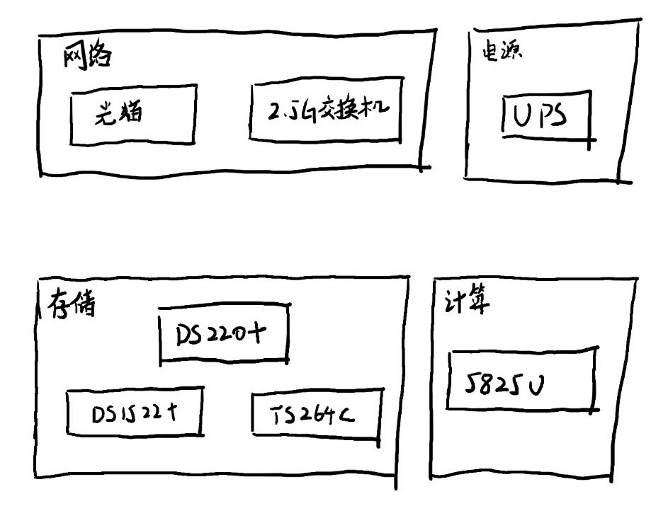

### 前言

仅供参考！仅供参考！每个家庭情况都不一样，最合适的就是坠好的！
 
自己之前用 n100 小主机搭的 pve，但是经历过主机冒烟（物理冒烟）后，重新反思了一下自己的架构，搭建了现在至少目前还算满意的硬件架构

### 搭建原则

我是出于这几个原则去搭的硬件的，希望也能给大家一些帮助

1. 数据需要备份。无论是重要照片数据还是 docker 服务数据，需要按照备份 321 原则
2. 存算分离，各司其职。nas 专心干存储的事情，docker 服务交给小主机干。并且没有 pve 等虚拟层，小主机就一个 linux，尽量低耦合
3. 放机器的地方通风要好，但灰尘要尽量少
4. 数据库尽量统一。现在都很喜欢每个服务用 docker compose 启动，每个服务 compose yaml 文件都有个数据库，我个人觉得这太杂了，如果需要数据库那就统一到自己的数据库服务中
5. 定时清理自己的服务。服务长时间家里没人用就下了吧

### 具体架构

基于以上原则，我搭建了现在的硬件架构

- 网络层：光猫+2.5g 交换机
- 电源层：ups
- 存储层：ds220+（备份），ds1522+（重要文件），ts264c（娱乐杂活）
- 计算层：5825u 小主机
   
  其中
- ds220+ 基本上就是干备份的活，每周会执行备份计划，同时也是 nvr 存家里的监控
- ds1522+ 专门干存储的活，存照片和重要文件，同时每周会增量加密备份到网盘
- ts264c 干剩下的一些杂活，比如存影视资源，旁路由等等
- 5825u 小主机就装了一个 portainer，所有服务都是用 docker 起的
   
  唯一的建议是——普通家庭用户就别碰 pve 那些虚拟化技术去搞什么 aio 了吧
