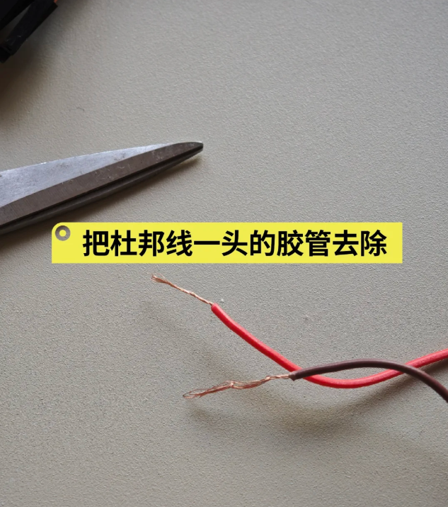
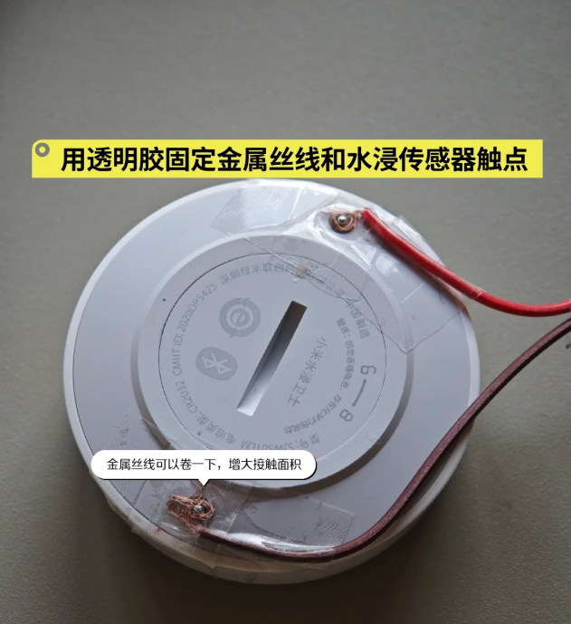
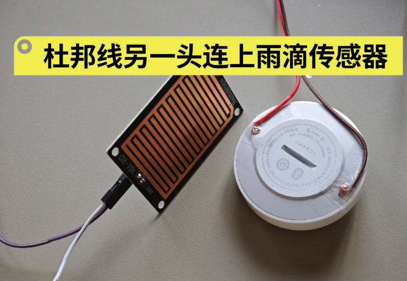

### 出发点

树莓派雨滴传感器的原理是面板上电路的短路会触发高信号，水浸卫士的原理也是底下两个触点短路就触发报警信号，所以我就想着这两个能不能结合一下。

### 为什么不用领普的水浸

我家有雨棚，如果要准确知道外面是否下雨就得装的很远，导致超出了蓝牙传输信号，蓝牙网关连不到。领普的使用场景还是装在室内侧，室内飘到雨了主动关窗。

### 改造方法

很简单，大体来说就是用杜邦线连上水浸卫士和雨滴传感器就行了
 

1. 杜邦线的一头用剪刀把电线剥离出来
   
2. 透明胶固定金属丝线和水浸传感器
   
3. 杜邦线另一头连上雨滴传感板
   
    
   主体就做好了，剩下固定的任务，大家自由发挥就行。
